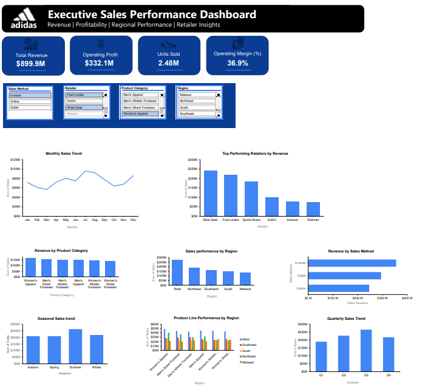

# adidas-sales-performance-analysis

## Project Overview

This project analyses Adidas retail sales data to evaluate sales performance, profitability, regional trends and retailer contributions. An interactive dashboard was developed in Microsoft Excel to support data-driven business decision-making.

## Business Problem

Adidas collects sales data across multiple retailers, product categories and sales channels. However, without effective analysis, valuable insights remain hidden, making it difficult to identify top-performing products, regions and retailers.

## Project Objectives

- Measure overall sales and profitability.
- Identify top-performing product categories.
- Compare retailer performance.
- Analyse regional sales performance.
- Evaluate sales methods.
- Provide business recommendations based on the findings.

## Dataset

The dataset contains Adidas retail sales data, including:

- Retailers
- Product categories
- Regions
- Sales methods
- Revenue
- Operating profit
- Units sold
- Time-based sales information

## Tools Used

- Microsoft Excel
- Pivot Tables
- Pivot Charts
- Slicers
- Dashboard Design

## Dashboard Preview



## Key Insights

### Revenue Performance
- Adidas generated **$899.9M** in total revenue during the analysis period.
- The business achieved an operating profit of **$332.1M**, resulting in an operating margin of **36.9%**.

### Product Performance
- Women's Apparel generated the highest revenue among all product categories.
- Revenue was relatively balanced across product categories, indicating a diversified product portfolio.

### Regional Performance
- The West region recorded the highest sales revenue.
- The Midwest region generated the lowest revenue among the five regions.

### Retailer Performance
- West Gear was the highest-performing retail partner.
- Foot Locker ranked second in revenue contribution.

### Sales Method
- In-store sales generated the highest revenue.
- Online sales contributed the lowest revenue, highlighting an opportunity for digital growth.
  
## Key Business Questions

1. Which product categories generate the highest revenue?
2. Which regions perform best?
3. Which retailers contribute the most revenue?
4. Which sales method generates the highest sales?
5. How do sales trends change over time?

## Business Recommendations

### Product Strategy
- Continue investing in high-performing product categories such as Women's Apparel while monitoring lower-performing categories for growth opportunities.

### Regional Strategy
- Increase inventory allocation and marketing efforts in high-performing regions.
- Investigate factors contributing to lower sales in underperforming regions and develop targeted improvement strategies.

### Retail Partner Management
- Strengthen relationships with top-performing retailers such as West Gear and Foot Locker.
- Work with lower-performing retailers to identify opportunities for improving sales performance.

### Sales Channel Optimisation
- Continue supporting in-store sales while investing in digital marketing initiatives to increase online sales.

### Data-Driven Decision Making
- Use dashboards to monitor key performance indicators regularly and support evidence-based business decisions.

## Repository Structure

```text
adidas-sales-performance-analysis/
│
├── README.md
├── LICENSE
├── data/
├── dashboard/
├── images/
└── report/
```

## Author

**Wendy Shabalala**
